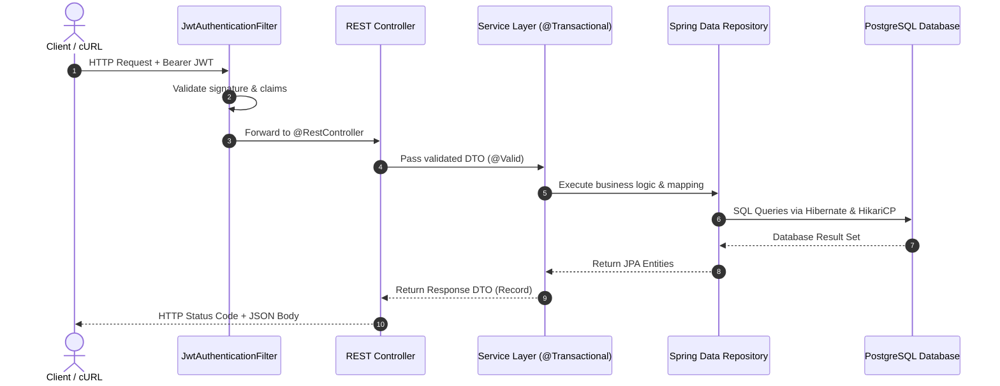

# TaskManager Service

A production-ready, modern RESTful Task Management backend service built with **Java 25** and **Spring Boot 4.x**.

This application demonstrates enterprise-grade Spring Boot architecture, including stateless JSON Web Token (JWT) authentication, Role-Based and Resource-Based Access Control (RBAC), database persistence with Spring Data JPA and PostgreSQL, Java Virtual Threads, RFC 9457 problem detail error handling, and comprehensive unit and integration testing.

---

## Table of Contents

- [TaskManager Service](#taskmanager-service)
  - [Table of Contents](#table-of-contents)
  - [Technology Stack](#technology-stack)
  - [Prerequisites](#prerequisites)
  - [The Maven Wrapper (`mvnw`) Guide](#the-maven-wrapper-mvnw-guide)
    - [What is the Maven Wrapper?](#what-is-the-maven-wrapper)
    - [Using `mvnw` Across Platforms](#using-mvnw-across-platforms)
    - [Essential `mvnw` Commands](#essential-mvnw-commands)
  - [Database Setup](#database-setup)
  - [Configuration](#configuration)
  - [Running the Application](#running-the-application)
  - [Project Architecture \& Layout](#project-architecture--layout)
  - [API Walkthrough \& Quickstart](#api-walkthrough--quickstart)
    - [1. Register a New User](#1-register-a-new-user)
    - [2. Authenticate (Login) and Obtain a JWT](#2-authenticate-login-and-obtain-a-jwt)
    - [3. Create a Task (Authenticated)](#3-create-a-task-authenticated)
    - [4. List Tasks (with Pagination \& Filtering)](#4-list-tasks-with-pagination--filtering)
    - [5. Update a Task](#5-update-a-task)
    - [6. Delete a Task](#6-delete-a-task)
    - [7. Health Check (Actuator)](#7-health-check-actuator)
  - [Testing](#testing)
  - [Modern Java Features Highlight](#modern-java-features-highlight)
  - [Containerization & Custom Server JRE (jlink)](#containerization--custom-server-jre-jlink)
  - [Troubleshooting & Common Pitfalls](#troubleshooting--common-pitfalls)
  - [Related Documentation & Glossary](#related-documentation--glossary)

---

## Technology Stack

- **Language:** Java 25 (with Virtual Threads enabled via Project Loom)
- **Framework:** Spring Boot 4.1.1
- **Security:** Spring Security & JJWT (0.12.5) with HMAC-SHA256 tokens & BCrypt password hashing
- **Persistence:** Spring Data JPA / Hibernate ORM & PostgreSQL (with HikariCP connection pooling)
- **Validation:** Jakarta Bean Validation (Hibernate Validator)
- **Error Handling:** RFC 9457 Standardized Problem Details (`GlobalExceptionHandler`)
- **Documentation:** Maven Javadoc Plugin (HTML5 Javadocs)
- **Testing:** JUnit 5, Mockito, AssertJ, Spring MockMvc, and H2 test database
- **Build Tool:** Apache Maven 3.9.x via the Maven Wrapper (`mvnw`)
- **Containerization:** Multi-stage Docker build producing a custom 63MB Server JRE via `jlink` on Alpine Linux 3.21 (202MB total image)

---

## Prerequisites

Before running the application, ensure you have the following installed:

1. **Java Development Kit (JDK) 25 or newer**:
   Verify your version in a terminal:
   ```bash
   java -version
   ```
   Ensure your `JAVA_HOME` environment variable points to your JDK 25 installation.

2. **PostgreSQL Database**:
   A PostgreSQL server running locally (or via Docker) on port `5432`.
   See [Database Setup](#database-setup) below for schema and user creation.

> [!NOTE]
> **No global Maven installation is required!** The repository provides the Maven Wrapper (`mvnw`), which downloads and manages the correct Maven binary for you.

---

## The Maven Wrapper (`mvnw`) Guide

### What is the Maven Wrapper?

If you are new to Java, you might wonder why you see files named `mvnw` and `mvnw.cmd` instead of installing Maven directly (`mvn`).

The **Maven Wrapper** is an industry standard that guarantees **reproducible builds**. It bundles a small script and launcher inside `.mvn/wrapper/` that automatically downloads the exact version of Apache Maven tested and certified for this project (e.g., Maven 3.9.16).

**Why use it?**
- You do not need to download, install, or configure Maven manually on your operating system.
- Every developer on your team, as well as Continuous Integration (CI) servers, uses the identical Maven version and runtime flags.
- It eliminates the classic *"it builds on my machine but fails on yours"* problem.

### Using `mvnw` Across Platforms

Depending on your operating system and terminal:

- **Linux / macOS (Bash or Zsh):**
  Prefix commands with `./mvnw`
  ```bash
  ./mvnw <command>
  ```
  *(If you encounter a `Permission denied` error, run `chmod +x mvnw` once to make it executable).*

- **Windows (Command Prompt / PowerShell):**
  Use `mvnw.cmd` (or `.\mvnw.cmd` in PowerShell)
  ```powershell
  .\mvnw.cmd <command>
  ```

> For the remainder of this guide, examples will use `./mvnw`. If you are on Windows, simply replace `./mvnw` with `.\mvnw.cmd`.

### Essential `mvnw` Commands

| Task | Command | Description |
| :--- | :--- | :--- |
| **Verify Setup** | `./mvnw -version` | Displays Maven and Java versions |
| **Compile Code** | `./mvnw compile` | Compiles main source files in `src/main/java` |
| **Run Tests** | `./mvnw test` | Executes unit, slice, and integration test suites |
| **Run Single Test** | `./mvnw test -Dtest=TaskServiceTest` | Runs only the specified test class |
| **Package JAR** | `./mvnw package` | Compiles, runs tests, and packages `target/taskmanager-0.0.1-SNAPSHOT.jar` |
| **Package (Skip Tests)** | `./mvnw clean package -DskipTests` | Cleans target and packages without running tests |
| **Run Spring Boot** | `./mvnw spring-boot:run` | Starts the embedded Tomcat server locally |
| **Generate Javadocs**| `./mvnw javadoc:javadoc` | Generates rich HTML5 API docs in `Documentation/Spring Boot App Javadocs` |
| **Clean Build** | `./mvnw clean` | Deletes the `target/` directory and build artifacts |
| **View Dependencies** | `./mvnw dependency:tree` | Displays the hierarchical tree of project dependencies |

---

## Database Setup

The application connects to a PostgreSQL database named `app_db` and uses an isolated schema named `tasks`.

The application uses Hibernate schema validation (`spring.jpa.hibernate.ddl-auto: validate`), which verifies that tables match JPA entity definitions without altering production schemas. Therefore, the database and schema must exist before boot.

You can set up your local PostgreSQL instance with `psql`:

```sql
-- 1. Create dedicated application user
CREATE USER spring_boot_user WITH PASSWORD 'ServerAppSecret123!';

-- 2. Create the application database
CREATE DATABASE app_db OWNER spring_boot_user;

-- 3. Connect to app_db and configure permissions
\c app_db

-- 4. Create the dedicated schema
CREATE SCHEMA IF NOT EXISTS tasks AUTHORIZATION spring_boot_user;

-- 5. Grant usage & creation rights
GRANT ALL PRIVILEGES ON SCHEMA tasks TO spring_boot_user;
ALTER USER spring_boot_user SET search_path TO tasks, public;
```

---

## Configuration

Application properties are defined in [`src/main/resources/application.yaml`](file:///home/jeffkerns/Development/TaskApp/backend/src/main/resources/application.yaml):

```yaml
spring:
  application:
    name: taskmanager
  threads:
    virtual:
      enabled: true               # Enables Java 21+ Project Loom Virtual Threads
  datasource:
    url: jdbc:postgresql://localhost:5432/app_db?currentSchema=tasks
    username: spring_boot_user
    password: ServerAppSecret123!
    hikari:
      maximum-pool-size: 10
  jpa:
    open-in-view: false           # Closes DB connection after service tier completes (avoids N+1 in web tier)
    hibernate:
      ddl-auto: validate          # Fails fast at boot if database schema does not match JPA entities
    show-sql: true

application:
  security:
    jwt:
      secret-key: <256-bit-hmac-sha256-key>
      expiration-ms: 900000       # 15 minutes (NIST SP 800-63B inactivity guideline)

server:
  port: 8080                     # Application listens on http://localhost:8080
```

---

## Running the Application

1. **Verify your database** is running on `localhost:5432`.
2. **Start the application** using the Maven Wrapper:
   ```bash
   ./mvnw spring-boot:run
   ```
3. Once started, you will see a banner in the console and the log message:
   ```text
   Started TaskmanagerApplication in X.XXX seconds
   ```
4. The service will be accepting HTTP traffic on `http://localhost:8080`.

---

## Project Architecture & Layout

This project adheres to a clean, layered Spring Boot architectural pattern:

```text
src/main/java/info/jeffkerns/taskmanager/
├── TaskmanagerApplication.java    # Spring Boot bootstrap & @EnableSpringDataWebSupport
├── config/                        # Security filter chain, JWT filter, configuration properties
│   ├── JwtAuthenticationFilter.java
│   ├── JwtProperties.java
│   └── SecurityConfig.java
├── controller/                    # REST presentation layer (@RestController endpoints)
│   ├── AuthController.java        # Public user registration & login
│   ├── TaskController.java        # Task CRUD, search, filter, pagination
│   └── UserController.java        # User account management & administrative endpoints
├── dto/                           # Data Transfer Objects (Immutable Java Records)
│   ├── request/                   # Request payloads with Jakarta Validation annotations
│   └── response/                  # Structured, serialized JSON response records
├── entity/                        # JPA Entities mapped to PostgreSQL tables
│   ├── TaskEntity.java
│   ├── TaskPriority.java          # LOW, MEDIUM, HIGH, URGENT
│   ├── TaskStatus.java            # TODO, IN_PROGRESS, REVIEW, DONE
│   ├── UserEntity.java            # Implements Spring Security UserDetails
│   └── UserRole.java              # ROLE_USER, ROLE_ADMIN
├── exception/                     # Centralized RFC 9457 Problem Details exception handling
│   └── GlobalExceptionHandler.java
├── mapper/                        # Pure domain mapping between Entities and DTOs
├── repository/                    # Spring Data JPA interfaces (database operations)
│   ├── TaskRepository.java
│   └── UserRepository.java
├── security/                      # SpEL security evaluators for fine-grained ownership
│   ├── TaskSecurity.java          # Verifies task ownership before edit/delete
│   └── UserSecurity.java          # Verifies profile ownership
└── service/                       # Business logic and transactional boundaries (@Service)
    ├── AuthService.java           # Registration, authentication, token issuance
    ├── JwtService.java            # JWT creation, signature validation, claim extraction
    ├── TaskService.java           # Task business rules
    ├── UserService.java           # User business rules & BCrypt password hashing
    └── impl/                      # Concrete service implementations
```

### The Request Lifecycle



---

## API Walkthrough & Quickstart

Here is an end-to-end workflow using `curl`.

### 1. Register a New User

```bash
curl -i -X POST http://localhost:8080/api/v1/auth/register \
  -H "Content-Type: application/json" \
  -d '{
    "username": "alice",
    "email": "alice@example.com",
    "password": "SecurePassword123!"
  }'
```
*Expected Response:* `201 Created` with a `Location` header and user metadata.

---

### 2. Authenticate (Login) and Obtain a JWT

```bash
curl -i -X POST http://localhost:8080/api/v1/auth/login \
  -H "Content-Type: application/json" \
  -d '{
    "username": "alice",
    "password": "SecurePassword123!"
  }'
```

*Expected Response:* `200 OK`
```json
{
  "accessToken": "eyJhbGciOiJIUzI1NiJ9...",
  "tokenType": "Bearer",
  "expiresInMs": 900000,
  "username": "alice",
  "role": "ROLE_USER"
}
```

> **Save this token:** Export it in your shell:
> ```bash
> export TOKEN="eyJhbGciOiJIUzI1NiJ9..."
> ```

---

### 3. Create a Task (Authenticated)

```bash
curl -i -X POST http://localhost:8080/api/v1/tasks \
  -H "Authorization: Bearer $TOKEN" \
  -H "Content-Type: application/json" \
  -d '{
    "title": "Build Spring Boot API",
    "description": "Implement authentication and task endpoints",
    "status": "TODO",
    "priority": "HIGH",
    "dueDate": "2026-12-31",
    "assignedUserId": 1
  }'
```
*Expected Response:* `201 Created` with `Location: /api/v1/tasks/1`.

---

### 4. List Tasks (with Pagination & Filtering)

Supports query parameters `status`, `search`, `page`, `size`, and `sort`:

```bash
curl -i -X GET "http://localhost:8080/api/v1/tasks?status=TODO&page=0&size=5&sort=priority,desc" \
  -H "Authorization: Bearer $TOKEN"
```
*Expected Response:* `200 OK` with paginated task collection.

---

### 5. Update a Task

Only the task owner or an administrator can update the task:

```bash
curl -i -X PUT http://localhost:8080/api/v1/tasks/1 \
  -H "Authorization: Bearer $TOKEN" \
  -H "Content-Type: application/json" \
  -d '{
    "title": "Build Spring Boot API",
    "description": "Tasks completed and tested!",
    "status": "DONE",
    "priority": "HIGH",
    "dueDate": "2026-12-31",
    "assignedUserId": 1
  }'
```
*Expected Response:* `200 OK` with updated task payload.

---

### 6. Delete a Task

```bash
curl -i -X DELETE http://localhost:8080/api/v1/tasks/1 \
  -H "Authorization: Bearer $TOKEN"
```
*Expected Response:* `204 No Content`.

---

### 7. Health Check (Actuator)

```bash
curl -i -X GET http://localhost:8080/actuator/health
```
*Expected Response:* `200 OK` with `{"status":"UP"}`.

---

## Testing

The project includes an automated test suite across all layers:

1. **Unit Tests (Mockito):** Test business logic in isolation without starting a web container or database (`TaskServiceTest`, `UserServiceTest`).
2. **Web Slice Tests (`@WebMvcTest`):** Test HTTP mappings, request validation, and status codes with MockMvc (`AuthControllerTest`, `TaskControllerTest`).
3. **Data Slice Tests (`@DataJpaTest`):** Test repository queries, constraints, and audit timestamps (`TaskRepositoryTest`).
4. **Full-Stack Integration Tests (`@SpringBootTest`):** Test the entire stack from HTTP request to database and back with rollback transactions (`TaskManagerIntegrationTest`, `TaskmanagerApplicationTests`).

Execute the tests via the Maven Wrapper:

```bash
# Run all tests
./mvnw test

# Run a specific test class
./mvnw test -Dtest=TaskManagerIntegrationTest

# Run a specific test method
./mvnw test -Dtest=TaskManagerIntegrationTest#fullUserLifecycleWorkflow_Succeeds
```

---

## Modern Java Features Highlight

This project is built using modern Java language features:

- **Java Records:** All DTOs (e.g., [`CreateTaskRequest`](file:///home/jeffkerns/Development/TaskApp/backend/src/main/java/info/jeffkerns/taskmanager/dto/request/CreateTaskRequest.java), [`TaskResponse`](file:///home/jeffkerns/Development/TaskApp/backend/src/main/java/info/jeffkerns/taskmanager/dto/response/TaskResponse.java)) are implemented as records for immutability, built-in constructors, and concise syntax.
- **Text Blocks (`"""`):** Clean, readable multiline JSON payloads in tests without manual quote escaping.
- **Java Virtual Threads (Project Loom):** Configured in `application.yaml` via `spring.threads.virtual.enabled: true` for high-concurrency throughput with lightweight thread management.
- **Java 21+ Sequenced Collections:** Clean collection operations such as `.getFirst()` used across services and tests.
- **Flexible Constructor Bodies (Java 25):** Pre-`super(...)` input validation in domain exceptions.

---

## Containerization & Custom Server JRE (`jlink`)

The backend container utilizes a **3-stage multi-stage Docker build** that assembles a tailored, minimal **Server JRE** using `jdeps` and `jlink`:

1. **Stage 1 (`build`)**: Compiles and packages the application using Eclipse Temurin JDK 25 on Alpine.
2. **Stage 2 (`jlink`)**: Unpacks the JAR, runs `jdeps` to determine required module dependencies, includes necessary dynamic Spring/Netty/SQL modules (`java.base`, `java.sql`, `java.naming`, `java.instrument`, `jdk.unsupported`, etc.), and links a stripped headless runtime image (`--strip-debug`, `--no-man-pages`, `--no-header-files`, `--compress=zip-6`).
3. **Stage 3 (`runtime`)**: Minimal `alpine:3.21` runtime with `ca-certificates`, `tzdata`, and `libstdc++`, executing the Spring Boot fat JAR under an unprivileged `spring:spring` user.

### Key Benefits & Footprint Comparison

| Component | Standard JRE | Custom `jlink` Server JRE | Reduction |
| :--- | :---: | :---: | :---: |
| **Java Runtime on Disk** | 227 MB (`eclipse-temurin:25-jre-alpine`) | **62.9 MB** (`/opt/jre`) | **-72.3%** |
| **Total Container Image** | ~290 MB (estimated) | **202 MB** (`taskapp-backend`) | **-30.3%** |
| **Security Surface** | Full standard library & debug tools | **21 modules** strictly required | Hardened |

### Building the Image Locally

To build and tag the container image locally:

```bash
./backend/build.sh taskapp-backend:latest
```

---

## Troubleshooting & Common Pitfalls

### 1. `Permission denied: ./mvnw`
If your terminal gives a permission denied error when executing `./mvnw`:
```bash
chmod +x mvnw
```

### 2. `Connection to localhost:5432 refused`
Ensure PostgreSQL is active and listening on port 5432:
```bash
sudo systemctl status postgresql
# or if using Docker:
docker ps
```

### 3. `Schema-validation: missing table [tasks.users]`
The application uses `ddl-auto: validate`. Make sure your database contains the `tasks` schema and that the necessary tables have been created before starting the application.

### 4. `Unsupported class file version` or Java version mismatch
Verify that your terminal session is using JDK 25:
```bash
java -version
```
If you have multiple JDKs installed, configure `JAVA_HOME`:
```bash
export JAVA_HOME=/path/to/jdk-25
export PATH=$JAVA_HOME/bin:$PATH
```

---

## Related Documentation & Glossary

* **[Technical & Architectural Glossary](../docs/Glossary.md):** Deep-dive definitions for Java 25 Virtual Threads, Spring Boot 4, HikariCP, `open-in-view: false`, and RFC 9457 error models.
* **[System Design Document](../docs/System%20Design%20Document.md):** Architecture decision records (ADRs), NIST SP 800-63B / SP 800-53 security alignment, and sequence flows.
* **[Database Data Dictionary](../docs/Data%20Dictionary.md):** PostgreSQL 18 table catalogs, custom ENUM mappings, and indexing strategies.
* **[Root Project Guide](../README.md):** Repository layout and multi-container Docker Compose setup.
