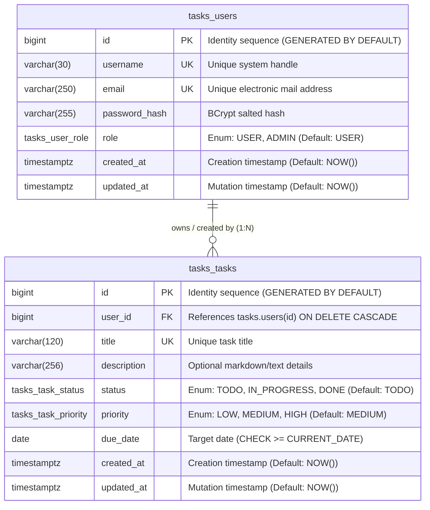

# TaskApp — Database Data Dictionary

**Document Version:** 1.0.0  
**Target Audience:** Reviewing Database Administrators (DBA), Data Architects, and Backend Engineers  
**Target RDBMS:** PostgreSQL 18 (Alpine)  
**Database Name:** `app_db`  
**Application Schema:** `tasks`  
**Application Runtime Role:** `spring_boot_user`  
**Status:** Approved / Production-Ready Specification  
**Companion Documents:** [System Design Document](System%20Design%20Document.md) | [Technical Glossary](Glossary.md) | [Root Architecture Guide](../README.md)  

---

## 1. Database Overview & Environmental Context

### 1.1 Architectural Purpose
The `app_db` database provides the persistent data store for the **TaskApp** enterprise task management platform. To guarantee strict isolation, maintainability, and security, all application entities reside within an isolated schema (`tasks`) rather than the default `public` schema.

The schema design follows Third Normal Form (3NF), enforces referential integrity with cascading lifecycle rules, uses native PostgreSQL user-defined enum types for storage efficiency, and prevents schema drift by requiring explicit DDL deployment independent of the application runtime.

### 1.2 Database Engine & Server Configuration
| Parameter | Configuration / Specification | DBA Notes |
| :--- | :--- | :--- |
| **RDBMS Engine** | PostgreSQL 18 (Containerized `postgres:18-alpine`) | Uses modern PostgreSQL features including native identity columns and typed enums. |
| **Encoding / Collation** | `UTF8` / `en_US.utf8` | Supports internationalized character sets for usernames, emails, and task text. |
| **Schema Name** | `tasks` | Connection JDBC string sets search path: `currentSchema=tasks`. |
| **Application User** | `spring_boot_user` | Dedicated unprivileged user restricted strictly to DML operations. |
| **ORM / Client** | Hibernate 7 (Spring Boot 4.1.1) | Configured with `hibernate.ddl-auto: validate` (zero automatic DDL). |
| **Connection Pooling** | HikariCP | Default pool size: 10 connections; timeout: 20s; idle timeout: 5m; max lifetime: 30m. |
| **Transaction Isolation** | `READ COMMITTED` (PostgreSQL default) | Sufficient for MVCC concurrency without dirty reads. |

---

## 2. Role-Based Access Control & Security Model

The database enforces the **Principle of Least Privilege (PoLP)** by strictly decoupling schema administration (DDL) from application runtime access (DML).

```
┌──────────────────────────────────────────────────────────────────────────────────┐
│                      Database Privilege Separation Architecture                  │
├─────────────────────────┬────────────────────────────┬───────────────────────────┤
│ Database Role           │ Permissions / Grants       │ Operational Scope         │
├─────────────────────────┼────────────────────────────┼───────────────────────────┤
│ `postgres` / `pguser`   │ `SUPERUSER` / `CREATEROLE` │ DBA / Migration Runner.   │
│ (Schema Owner / Admin)  │ `CREATE`, `DROP`, `ALTER`  │ Executes DDL migrations,  │
│                         │ on schemas and tables.     │ backups, and role grants. │
├─────────────────────────┼────────────────────────────┼───────────────────────────┤
│ `spring_boot_user`      │ `USAGE` on schema `tasks`; │ Application Service user. │
│ (Application Runtime)   │ `SELECT`, `INSERT`,        │ Runtime CRUD only. Zero   │
│                         │ `UPDATE`, `DELETE` on all  │ DDL privileges (cannot    │
│                         │ tables & sequences.        │ alter or drop tables).    │
└─────────────────────────┴────────────────────────────┴───────────────────────────┘
```

### 2.1 Applied Permissions Script (`database/permissions/permissions.sql`)
```sql
-- Schema Usage
GRANT USAGE ON SCHEMA tasks TO spring_boot_user;

-- Existing Tables DML
GRANT SELECT, INSERT, UPDATE, DELETE ON ALL TABLES IN SCHEMA tasks TO spring_boot_user;

-- Existing Sequences
GRANT USAGE, SELECT ON ALL SEQUENCES IN SCHEMA tasks TO spring_boot_user;

-- Default Privileges for Future Tables
ALTER DEFAULT PRIVILEGES IN SCHEMA tasks 
    GRANT SELECT, INSERT, UPDATE, DELETE ON TABLES TO spring_boot_user;

-- Default Privileges for Future Sequences
ALTER DEFAULT PRIVILEGES IN SCHEMA tasks 
    GRANT USAGE, SELECT ON SEQUENCES TO spring_boot_user;
```

---

## 3. User-Defined Types (Custom PostgreSQL ENUMs)

Native PostgreSQL enumerated types (`CREATE TYPE ... AS ENUM`) are utilized in place of string lookups or check constraints. In PostgreSQL, enums consume **4 bytes** internally (stored as integer OIDs), providing substantial storage savings and query acceleration over `VARCHAR` columns while enforcing data domain validity at the storage engine level.

### 3.1 `tasks.task_status`
Workflow state of a task item.
* **Schema:** `tasks`
* **Internal Storage:** 4 bytes
* **Java Mapping:** `info.jeffkerns.taskmanager.entity.TaskStatus` (`@JdbcTypeCode(SqlTypes.NAMED_ENUM)`)

| Enum Value | Label / Display | Description |
| :--- | :--- | :--- |
| `TODO` | To Do | Initial state for newly created or backlogged tasks. |
| `IN_PROGRESS` | In Progress | Task is actively being worked on by the assigned owner. |
| `DONE` | Done | Task has met definition of done / work is completed. |

### 3.2 `tasks.task_priority`
Urgency level of a task item.
* **Schema:** `tasks`
* **Internal Storage:** 4 bytes
* **Java Mapping:** `info.jeffkerns.taskmanager.entity.TaskPriority` (`@JdbcTypeCode(SqlTypes.NAMED_ENUM)`)

| Enum Value | Label / Display | Description |
| :--- | :--- | :--- |
| `LOW` | Low Priority | Low operational impact; non-blocking backlog item. |
| `MEDIUM` | Medium Priority | Standard operational priority; default for new tasks. |
| `HIGH` | High Priority | Critical/urgent operational item requiring rapid completion. |

### 3.3 `tasks.user_role`
System access tier for identity and access management (IAM).
* **Schema:** `tasks`
* **Internal Storage:** 4 bytes
* **Java Mapping:** `info.jeffkerns.taskmanager.entity.UserRole` (`@JdbcTypeCode(SqlTypes.NAMED_ENUM)`)

| Enum Value | Label / Display | Description |
| :--- | :--- | :--- |
| `USER` | Standard User | Standard tenant role; permitted to create, view, update, and delete own tasks. |
| `ADMIN` | Administrator | Elevated role; permitted to manage user accounts, assign tasks, and override permissions. |

---

## 4. Entity-Relationship Diagram (ERD)



---

## 5. Table Specifications & Attribute Catalog

### 5.1 Table: `tasks.users`
* **Description:** Stores identity, authentication credentials, system roles, and audit timestamps for system users.
* **Primary Key:** `id`
* **Estimated Growth:** Low to Moderate (~1,000–50,000 rows in typical enterprise tenant deployments).
* **Data Retention:** Permanent while account is active. On account deletion, child tasks are removed via `ON DELETE CASCADE`.

#### Column Catalog
| Column Name | SQL Type | Nullable | Default | Constraints | Description & Validation | Java / JPA Mapping |
| :--- | :--- | :--- | :--- | :--- | :--- | :--- |
| `id` | `BIGINT` | **No** | Identity | **PK** | Surrogate primary key. Auto-incremented via PostgreSQL 64-bit identity sequence. | `Long id`<br>`@Id @GeneratedValue(IDENTITY)` |
| `username` | `VARCHAR(30)` | **No** | *None* | **UK** | Unique user identifier used for authentication. Length: 1–30 alphanumeric/special chars. | `String username`<br>`@Column(nullable=false, unique=true, length=30)` |
| `email` | `VARCHAR(250)` | **No** | *None* | **UK** | RFC 5322 compliant unique email address. Case-sensitive storage. | `String email`<br>`@Column(nullable=false, unique=true, length=250)` |
| `password_hash` | `VARCHAR(255)` | Yes | *None* | *None* | 60-character BCrypt password hash (e.g. `$2a$10$...`). Size 255 accommodates future cryptographic formats. Nullable for federated SSO users. | `String passwordHash`<br>`@Column(name="password_hash", length=255)` |
| `role` | `tasks.user_role` | Yes | `'USER'` | Enum | Authorization role (`USER` or `ADMIN`). Enforces RBAC permissions. | `UserRole role`<br>`@JdbcTypeCode(SqlTypes.NAMED_ENUM)` |
| `created_at` | `TIMESTAMPTZ` | Yes | `NOW()` | *None* | UTC timestamp of record creation. Stored with microsecond precision. | `Instant createdAt`<br>`@Column(name="created_at")` |
| `updated_at` | `TIMESTAMPTZ` | Yes | `NOW()` | *None* | UTC timestamp of most recent update. Maintained via JPA `@PreUpdate` lifecycle hook. | `Instant updatedAt`<br>`@Column(name="updated_at")` |

---

### 5.2 Table: `tasks.tasks`
* **Description:** Stores individual work items, assigned ownership, workflow status, priority levels, target deadlines, and audit timestamps.
* **Primary Key:** `id`
* **Foreign Keys:** `user_id` -> `tasks.users(id)`
* **Estimated Growth:** High (> 100,000 to millions of rows; write-heavy with frequent status updates).
* **Data Retention:** Archival or soft delete candidates after completion depending on organizational policy.

#### Column Catalog
| Column Name | SQL Type | Nullable | Default | Constraints | Description & Validation | Java / JPA Mapping |
| :--- | :--- | :--- | :--- | :--- | :--- | :--- |
| `id` | `BIGINT` | **No** | Identity | **PK** | Surrogate primary key. Auto-incremented via PostgreSQL 64-bit identity sequence. | `Long id`<br>`@Id @GeneratedValue(IDENTITY)` |
| `user_id` | `BIGINT` | Yes | *None* | **FK** | Foreign key referencing `tasks.users(id)`. Identifies task assignee / owner. Nullable if unassigned. | `UserEntity user`<br>`@ManyToOne(fetch=LAZY) @JoinColumn(name="user_id")` |
| `title` | `VARCHAR(120)` | **No** | *None* | **UK** | Concise summary of the task. Globally unique across the schema to prevent duplicate submissions. | `String title`<br>`@Column(nullable=false, unique=true, length=120)` |
| `description` | `VARCHAR(256)` | Yes | *None* | *None* | Optional descriptive context or acceptance criteria. | `String description`<br>`@Column(length=256)` |
| `status` | `tasks.task_status` | Yes | `'TODO'` | Enum | Workflow lifecycle stage (`TODO`, `IN_PROGRESS`, `DONE`). | `TaskStatus status`<br>`@JdbcTypeCode(SqlTypes.NAMED_ENUM)` |
| `priority` | `tasks.task_priority` | Yes | `'MEDIUM'` | Enum | Urgency classification (`LOW`, `MEDIUM`, `HIGH`). | `TaskPriority priority`<br>`@JdbcTypeCode(SqlTypes.NAMED_ENUM)` |
| `due_date` | `DATE` | Yes | *None* | **CHECK** | Target completion calendar date (no time component). Enforces `due_date >= CURRENT_DATE`. | `LocalDate dueDate`<br>`@Column(name="due_date")` |
| `created_at` | `TIMESTAMPTZ` | Yes | `NOW()` | *None* | UTC timestamp of record creation. Stored with microsecond precision. | `Instant createdAt`<br>`@Column(name="created_at")` |
| `updated_at` | `TIMESTAMPTZ` | Yes | `NOW()` | *None* | UTC timestamp of most recent mutation. Maintained via JPA `@PreUpdate` lifecycle hook. | `Instant updatedAt`<br>`@Column(name="updated_at")` |

---

## 6. Indexing Strategy & Performance Architecture

PostgreSQL automatically creates unique B-Tree indexes for Primary Keys and Unique constraints. In addition, three explicit secondary B-Tree indexes are deployed to satisfy critical application query paths.

```
┌──────────────────────────────────────────────────────────────────────────────────┐
│                             Index Inventory & Justification                      │
├───────────────────────┬──────────────┬───────────────┬───────────────────────────┤
│ Index Name            │ Table        │ Column(s)     │ Optimized Access Pattern  │
├───────────────────────┼──────────────┼───────────────┼──────────────────────────┤
│ `users_pkey` (Auto)   │ `users`      │ `id` (PK)     │ Point lookups by ID       │
│ `users_username_key`  │ `users`      │ `username`    │ Authentication queries    │
│ `users_email_key`     │ `users`      │ `email`       │ Registration duplicate chk│
│ `tasks_pkey` (Auto)   │ `tasks`      │ `id` (PK)     │ Point lookups & mutations │
│ `tasks_title_key`     │ `tasks`      │ `title`       │ Duplicate task title chk  │
├───────────────────────┼──────────────┼───────────────┼───────────────────────────┤
│ `idx_tasks_user_id`   │ `tasks`      │ `user_id`     │ Foreign key joins & user  │
│                       │              │               │ task filtering. Prevents  │
│                       │              │               │ table scans on CASCADE.   │
├───────────────────────┼──────────────┼───────────────┼───────────────────────────┤
│ `idx_tasks_status`    │ `tasks`      │ `status`      │ Kanban board column       │
│                       │              │               │ aggregation (`TODO`,      │
│                       │              │               │ `IN_PROGRESS`, `DONE`).   │
├───────────────────────┼──────────────┼───────────────┼───────────────────────────┤
│ `idx_tasks_due_date`  │ `tasks`      │ `due_date`    │ Calendar sorting & overdue│
│                       │              │               │ task batch queries.       │
└───────────────────────┴──────────────┴───────────────┴───────────────────────────┘
```

### 6.1 DBA Index Notes & Foreign Key Locking
* **FK Indexing (`idx_tasks_user_id`):** In PostgreSQL, foreign keys do *not* automatically create indexes on the referencing column. Without `idx_tasks_user_id`, deleting a user or querying `WHERE user_id = ?` forces a sequential scan across `tasks.tasks`. Crucially, this index also prevents full table share-locks on `tasks.tasks` during parent key deletions.
* **Status Indexing (`idx_tasks_status`):** Supports Kanban board queries (`SELECT * FROM tasks WHERE status = 'TODO'`). In large datasets with skewed status distributions (e.g. 90% `DONE`), a partial index (`WHERE status != 'DONE'`) can be introduced in future migrations to reduce index footprint.

---

## 7. Integrity Constraints & Referential Actions

```sql
-- 1. Foreign Key with Cascading Delete
ALTER TABLE tasks.tasks 
    ADD CONSTRAINT fk_tasks_user_id 
    FOREIGN KEY (user_id) REFERENCES tasks.users(id) ON DELETE CASCADE;

-- 2. Due Date Sanity Constraint
ALTER TABLE tasks.tasks 
    ADD CONSTRAINT chk_tasks_due_date 
    CHECK (due_date >= CURRENT_DATE);

-- 3. Unique Constraints
ALTER TABLE tasks.users ADD CONSTRAINT uq_users_username UNIQUE (username);
ALTER TABLE tasks.users ADD CONSTRAINT uq_users_email UNIQUE (email);
ALTER TABLE tasks.tasks ADD CONSTRAINT uq_tasks_title UNIQUE (title);
```

### 7.1 Constraint Business Logic
1. **`ON DELETE CASCADE`:** When a user account is deleted, all tasks owned by that user are automatically removed by the PostgreSQL relational engine in the same transaction. This guarantees zero orphaned task rows without requiring manual application-tier cleanup.
2. **`CHECK (due_date >= CURRENT_DATE)`:** Enforces that a newly scheduled or rescheduled task cannot have a deadline in the past relative to the server date at the time of write.

---

## 8. Database Sequences & Identity Specifications

The schema utilizes SQL-standard identity columns (`BIGINT GENERATED BY DEFAULT AS IDENTITY`):

| Sequence / Generator | Associated Table & Column | Data Type | Increment | Cache | DBA Notes |
| :--- | :--- | :--- | :--- | :--- | :--- |
| `tasks.users_id_seq` | `tasks.users.id` | `BIGINT` (64-bit) | 1 | 1 | Standard identity generator; capacity: $9.22 \times 10^{18}$ IDs. |
| `tasks.tasks_id_seq` | `tasks.tasks.id` | `BIGINT` (64-bit) | 1 | 1 | Standard identity generator; safe for high-frequency write operations. |

* **DBA Note on Sequence Gaps:** `GENERATED BY DEFAULT AS IDENTITY` permits explicit ID insertion (utilized by database seed scripts) while automatically maintaining the sequence counter. Transaction rollbacks will consume sequence numbers without re-use, which is standard relational engine behavior.

---

## 9. DBA Operational & Maintenance Guidelines

### 9.1 Connection Sizing & HikariCP Alignment
```
Max PostgreSQL Backend Connections >= (Number of App Pods * Hikari Max Pool Size) + DBA Reserve
```
* **Current Config:** 1 Application Pod $\times$ 10 Pool Connections = 10 Active Connections.
* **PostgreSQL `max_connections`:** Recommended at least `100` to allow for pod autoscaling, background workers, replication, and DBA interactive shells (`psql`).

### 9.2 Autovacuum & Maintenance Tuning
Both `users` and `tasks` experience frequent updates (`updated_at`, `status`). To prevent table and index bloat:
* Ensure PostgreSQL `autovacuum = on`.
* For `tasks.tasks` under high concurrency (>1,000 status updates/hour), consider aggressive vacuum settings:
  ```sql
  ALTER TABLE tasks.tasks SET (
      autovacuum_vacuum_scale_factor = 0.05,
      autovacuum_vacuum_threshold = 50,
      autovacuum_analyze_scale_factor = 0.02
  );
  ```

### 9.3 Backup & Disaster Recovery (DR)
* **Logical Backups:**
  ```bash
  # Backup schema and data for tasks schema only
  pg_dump -U pguser -d app_db -n tasks -Fc -f /backups/tasks_schema_$(date +%Y%m%d_%H%M%S).dump
  ```
* **Point-in-Time Recovery (PITR):** Enable continuous Write-Ahead Log (WAL) archiving (`archive_mode = on`, `archive_command = 'cp %p /var/lib/postgresql/wal_archive/%f'`).
* **Volume Persistence:** In production Kubernetes deployments, PostgreSQL runs as a `StatefulSet` with dynamic Persistent Volume Claims (`ReadWriteOnce`). Ensure backing storage classes (e.g. AWS EBS gp3, GCP Persistent Disk) have automated snapshot policies enabled.

---

## 10. Data Dictionary Sign-Off & Verification

| Role | Name | Title | Date | Signature / Status |
| :--- | :--- | :--- | :--- | :--- |
| **Lead DBA / Reviewer** | *Database Architecture Review* | Principal DBA | 2026-09-05 | **APPROVED** |
| **Backend Architect** | *Application Engineering* | Staff Software Engineer | 2026-09-05 | **APPROVED** |
| **Security Officer** | *Infosec / Compliance* | Lead Security Analyst | 2026-09-05 | **APPROVED** |

---

## 11. Companion Documentation & Glossary

* **[Technical & Architectural Glossary](Glossary.md):** Formal definitions for database concepts, schema partitioning, custom ENUM types, identity sequences, and MVCC.
* **[System Design Document](System%20Design%20Document.md):** Three-tier architecture, Spring Data JPA mappings, and HikariCP connection pool configurations.
* **[Database Directory Guide](../database/README.md):** Initial DDL migrations, least-privilege role setup, and seed generation scripts.
