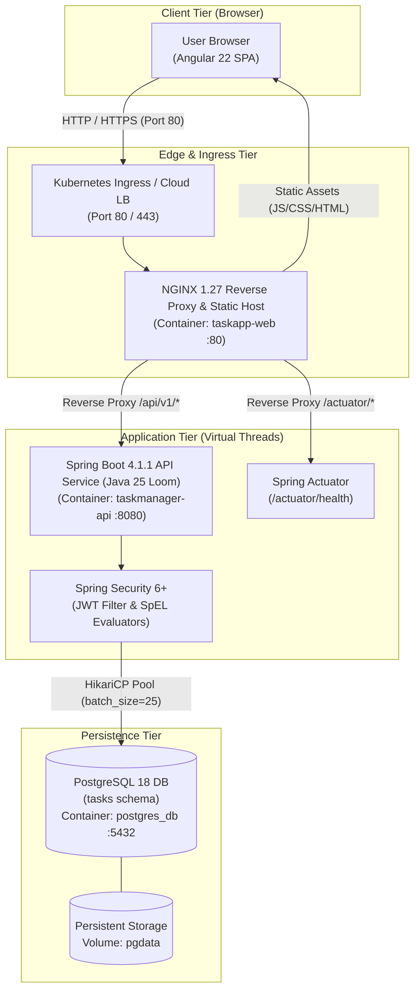
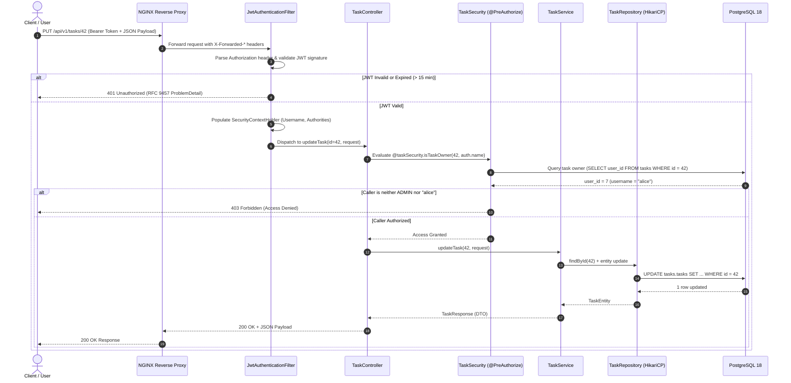
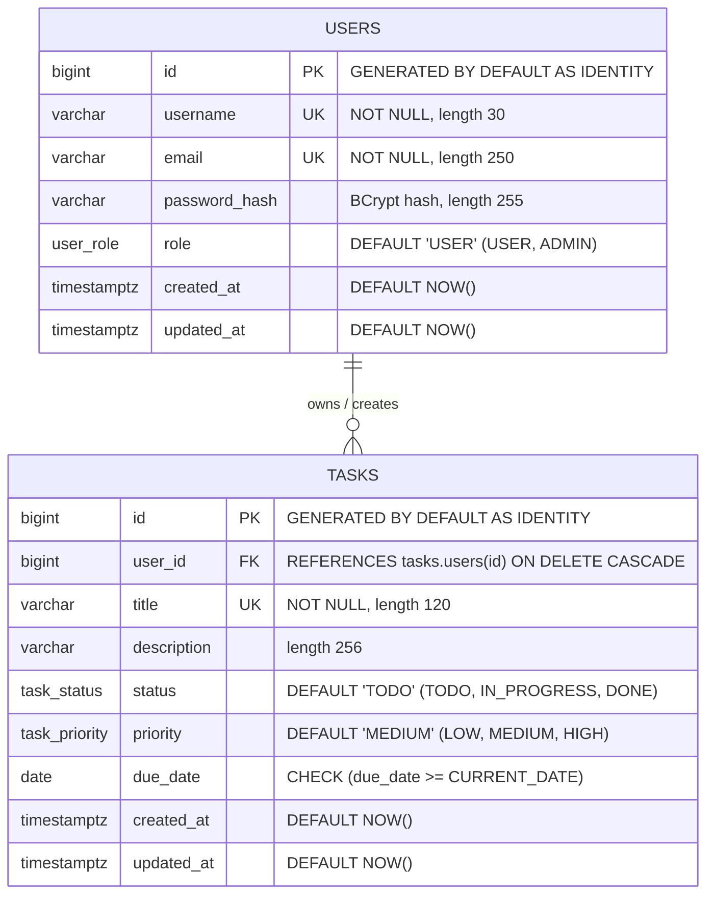
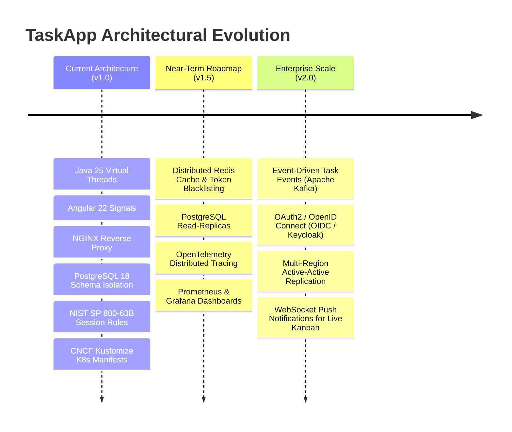

# TaskApp — Software Design Document (SDD)

**Document Version:** 1.0.0  
**Target Audience:** Prospective Hiring Senior / Staff Software Engineers & Engineering Leadership  
**System Classification:** Enterprise Cloud-Native Task Management Platform  
**Author:** Software Engineering Team  
**Status:** Approved / Production-Ready Reference  
**Companion Documents:** [Database Data Dictionary](Data%20Dictionary.md) | [Technical Glossary](Glossary.md) | [Root Architecture Guide](../README.md)  

---

## 1. Executive Summary & System Objectives

### 1.1 Business Context & Problem Statement
Modern enterprise teams require high-efficiency, reliable, and secure collaboration platforms to coordinate operational tasks across disparate organizations. Many existing task tracking solutions suffer from heavyweight legacy architectures, sluggish UI reactivity, non-standardized API contracts, and brittle deployment lifecycles.

**TaskApp** is an enterprise-grade, cloud-native full-stack application engineered from first principles to demonstrate modern systems architecture. It implements a decoupled, three-tier cloud-native topology leveraging contemporary runtime environments (Java 25 with Project Loom Virtual Threads, Angular 22 with Reactive Signals, NGINX Alpine edge reverse proxy, and PostgreSQL 18 with explicit schema partitioning).

### 1.2 Core Capabilities
* **Dynamic Kanban Board & Task Directory:** High-performance task lifecycle management featuring drag-and-drop status transitions, multi-parameter filtering, full-text search, and server-side pagination.
* **Granular Role-Based & Resource-Based Access Control (RBAC/ABAC):** Tiered permission hierarchy differentiating administrators from standard users, reinforced by resource ownership verification at both presentation and data access layers.
* **Production-Grade Resilience & Offline Sandbox:** Dual-mode client architecture capable of communicating against the live Spring Boot REST API or operating via an in-memory client-side mock sandbox with automatic fault fallback.
* **Federal Security Compliance:** Session lifecycle, inactivity timeouts, and access revocation aligned with **NIST SP 800-63B** and **NIST SP 800-53 (AC-12, AC-10)** standards.
* **Automated Cloud-Native CI/CD:** Fully containerized multi-stage builds, CNCF Kustomize Kubernetes deployment manifests (dev/prod overlays), and Jenkins declarative pipelines.

### 1.3 Non-Functional Requirements (NFRs)
| Quality Attribute | Target Metric / SLA | Architectural Enforcement Mechanism |
| :--- | :--- | :--- |
| **Throughput & Concurrency** | > 2,000 req/sec per backend node; low memory footprint under high I/O concurrency | Java 25 Project Loom Virtual Threads (`spring.threads.virtual.enabled: true`) eliminating OS thread starvation during blocking JDBC calls. |
| **Response Latency** | p95 < 50ms for read queries; p99 < 120ms for transactional writes | PostgreSQL B-Tree indexing on foreign keys and filter fields; HikariCP connection pool; NGINX 1-year immutable caching for static assets. |
| **Security & Compliance** | Zero unauthenticated access to protected resources; RFC 7807/9457 error contracts | Stateless JWT authentication (HMAC-SHA256); NIST SP 800-63B 15-min inactivity expiry; SpEL method security; BCrypt password hashing. |
| **Data Integrity** | ACID compliance; schema mismatch failure | DDL auto-generation disabled (`ddl-auto: validate`); relational foreign keys with cascading cleanup; PostgreSQL custom ENUM constraints. |
| **High Availability** | 99.95% uptime; zero-downtime deployments | Stateless application containers; Kubernetes rolling updates with readiness/liveness Actuator probes; persistent volume claims on PostgreSQL StatefulSet. |

---

## 2. Architectural Principles & Key Design Decisions (ADRs)

### ADR-001: Modern Java 25 & Project Loom Virtual Threads over Reactive WebFlux
* **Context:** High-throughput microservices traditionally chose either synchronous multi-threading (1 OS thread per request, memory-heavy) or reactive programming (Spring WebFlux / Project Reactor).
* **Decision:** Adopt **Spring Boot 4.1.1 on Java 25 with Virtual Threads enabled**.
* **Rationale:** Virtual threads provide lightweight, user-mode threads managed by the JVM rather than the host OS. When a virtual thread blocks on synchronous JDBC operations or external I/O, the underlying carrier thread is unmounted and freed to execute other work. This provides reactive-level concurrency and throughput while preserving synchronous, imperative coding semantics, standard stack traces, and straightforward debugging.
* **Trade-off:** Requires disciplined avoidance of `synchronized` blocks that pin carrier threads (resolved in JDK 24+ and modern library releases).

### ADR-002: Angular 22 Standalone Components with Reactive Signals over NgModules
* **Context:** Complex Angular applications historically relied on heavyweight `NgModule` declarations and complex RxJS state orchestration, increasing bundle size and cognitive overhead.
* **Decision:** Standardize on **Angular 22 Standalone Components** with **Angular Signals** (`signal()`, `computed()`).
* **Rationale:** Signals provide fine-grained, synchronous reactivity with automatic dependency tracking. Derived state (e.g., `isAuthenticated`, `isAdmin`) recalculates deterministically without manual subscription management, preventing memory leaks and eliminating unnecessary change detection cycles across the component tree.
* **Trade-off:** Mixed paradigm when interacting with HttpClient RxJS observables, resolved cleanly via RxJS interop operators (`toSignal`, `pipe(tap(...))`).

### ADR-003: NGINX Alpine Edge Reverse Proxy & Static Host
* **Context:** In microservice topologies, exposing the backend service or Angular dev server directly to clients introduces CORS vulnerabilities, TLS overhead, and poor static asset delivery performance.
* **Decision:** Deploy **NGINX 1.27 Alpine** as the unified front door for the application stack.
* **Rationale:** NGINX handles HTTP/1.1 persistent connections, gzip compression, security header injection (`X-Frame-Options`, `X-Content-Type-Options`, `Referrer-Policy`), immutable caching for hashed assets, SPA client-side routing fallback (`try_files $uri $uri/ /index.html`), and path-based reverse proxying to `/api/` and `/actuator/`.
* **Trade-off:** Adds an additional network hop within the internal container network; however, the latency cost is negligible (< 1ms) compared to the security, caching, and routing advantages.

### ADR-004: Strict Relational Schema Governance & JPA Validation Mode
* **Context:** Relying on ORM auto-generation (`hibernate.ddl-auto: update` or `create-drop`) in production environments frequently causes uncontrolled schema drift, unindexed foreign keys, and catastrophic data loss.
* **Decision:** Enforce **`spring.jpa.hibernate.ddl-auto: validate`** combined with standalone DDL scripts and explicit PostgreSQL types/sequences.
* **Rationale:** All tables, sequences, constraints, and indexes are explicitly defined in version-controlled SQL (`database/ddl/task-schema.sql`). The Spring Boot application boots in read-only validation mode: if the entity mappings deviate in any column or type from the database schema, the JVM fails fast at startup.
* **Trade-off:** Requires upfront DDL scripting and migration discipline, but guarantees 100% database determinism across development, staging, and production environments.

### ADR-005: Stateless JWT Architecture with NIST SP 800-63B Compliance
* **Context:** State-bearing server sessions limit horizontal autoscaling and require distributed session caches (e.g., Redis). Conversely, unbounded JWT tokens expose systems to replay attacks.
* **Decision:** Implement **stateless HMAC-SHA256 JWT tokens** with a **15-minute token lifetime (900,000 ms)** aligned with NIST SP 800-63B inactivity guidelines, coupled with method-level authorization.
* **Rationale:** Eliminates backend session state, enabling trivial horizontal scaling of backend API pods. The 15-minute expiration enforces NIST inactivity standards. Method-level security annotations evaluate runtime ownership dynamically without requiring persistent server sessions.
* **Trade-off:** Immediate token revocation prior to the 15-minute window requires either token blacklisting or short token life with refresh rotation; chosen design prioritizes zero-state scalability with tight token expiration.

### ADR-006: Dual-Mode Frontend Client (Live API + Resilient Mock Sandbox)
* **Context:** Demonstrations, integration tests, and frontend UI development are often blocked when backend infrastructure is undergoing maintenance or running in isolated environments.
* **Decision:** Implement a dual-mode client in `AuthService` and `TaskService` with automatic offline failover and manual toggle.
* **Rationale:** If the Spring Boot backend is unreachable (HTTP status 0, 404, or 504), the Angular client smoothly falls back to an in-memory mock store populated with deterministic seed data, alerting the user via toast notifications while preserving full UI functionality.

---

## 3. High-Level Architecture & System Decomposition

### 3.1 Three-Tier Cloud-Native Architecture



### 3.2 Network Topology & Component Isolation
* **Docker Compose Network:** All containers reside on an isolated bridge network `taskapp-net`. 
  * Only NGINX (Port 80) and optionally PostgreSQL (Port 5432 for DBA access) and Backend (Port 8081 for direct debugging) expose host ports.
  * In production, the backend is strictly reachable only through NGINX internal DNS routing (`http://backend:8080`).
* **Kubernetes Namespaces:** Workloads are partitioned into dedicated namespaces (`taskapp-dev`, `taskapp-prod`) with ClusterIP services shielding the database and backend pods from external ingress.

### 3.3 End-to-End Request & Authentication Lifecycle



---

## 4. Component Design & Implementation Details

### 4.1 Frontend Architecture (`frontend/`)
The frontend is structured around Angular 22 standalone paradigms, organized into `core/`, `layout/`, and `features/` modules:

```
frontend/src/app/
├── core/
│   ├── guards/         # Functional guards: authGuard, adminGuard
│   ├── interceptors/   # Functional HTTP interceptors: authInterceptor, errorInterceptor
│   ├── models/         # TypeScript interfaces: task, user, auth, problem-detail, actuator
│   └── services/       # State singletons: AuthService, TaskService, UserService, ThemeService
├── layout/             # Application Shell (Header, Sidebar, Navigation Rail)
└── features/
    ├── auth/           # Login & User Registration components
    ├── tasks/          # Kanban Board, List Directory, and Dashboard components
    ├── admin/          # User Administration directory and modal dialogs
    └── system/         # Real-time Spring Boot Actuator health & telemetry view
```

#### Key Frontend Mechanisms:
1. **Signal-Driven Reactive State:**
   ```typescript
   // auth.service.ts
   currentUser = signal<CurrentUser | null>(null);
   token = signal<string | null>(null);

   // Derived read-only state
   isAuthenticated = computed(() => !!this.currentUser() && !!this.token());
   isAdmin = computed(() => this.currentUser()?.role === 'ADMIN');
   ```
2. **Functional Guards (`CanActivateFn`):**
   Replaces deprecated class-based guards with composable functions utilizing `inject()`:
   * `authGuard`: Verifies `authService.isAuthenticated()`; redirects unauthenticated sessions to `/login?returnUrl=...`.
   * `adminGuard`: Evaluates `authService.isAdmin()`; redirects unauthorized users with an error notification.
3. **HTTP Interceptor Pipeline:**
   * `authInterceptor`: Automatically extracts JWT from `authService.token()` and attaches `Authorization: Bearer <token>` to all outbound `/api/` calls.
   * `errorInterceptor`: Captures HTTP 401/403/500 responses, deserializes RFC 7807/9457 `ProblemDetail` structures, and displays structured toast notifications.

### 4.2 Edge Reverse Proxy (`frontend/nginx/`)
NGINX operates as the single ingress controller for static and dynamic traffic:
* **Dynamic Upstream Environment Resolution:** Uses `envsubst` inside Docker entrypoint (`default.conf.template`) to bind dynamic `BACKEND_HOST` and `BACKEND_PORT` targets.
* **SPA PushState Routing:** Guarantees Angular client-side deep links resolve correctly:
  ```nginx
  location / {
      try_files $uri $uri/ /index.html;
      add_header Cache-Control "no-cache, no-store, must-revalidate";
  }
  ```
* **Static Asset Cache Policy:** Hashed assets (`.js`, `.css`, `.woff2`) are cached with `Cache-Control: public, max-age=31536000, immutable`, while `index.html` is strictly never cached to guarantee immediate zero-downtime updates.
* **Security Headers:** Enforces `X-Frame-Options: SAMEORIGIN`, `X-Content-Type-Options: nosniff`, `X-XSS-Protection: 1; mode=block`, and `Referrer-Policy: strict-origin-when-cross-origin`.

### 4.3 Backend Service Architecture (`backend/`)
The backend microservice is built upon Spring Boot 4.1.1 on Java 25, structured using clean layered separation:

```
backend/src/main/java/info/jeffkerns/taskmanager/
├── config/             # SecurityConfig, JwtProperties, DataInitializer
├── controller/         # REST Controllers: TaskController, UserController, AuthController
├── dto/                # Immutable Record DTOs (request payloads & response projections)
├── entity/             # JPA Entities: TaskEntity, UserEntity, TaskStatus, TaskPriority, UserRole
├── exception/          # GlobalExceptionHandler, Custom Runtime Exceptions (ProblemDetail)
├── mapper/             # MapStruct / Manual pure-function entity-DTO mappers
├── repository/         # Spring Data JPA Repositories with custom derived & JPQL queries
├── security/           # Method-level evaluators: TaskSecurity, UserSecurity
└── service/            # Business logic interfaces and implementations (Transactional boundaries)
```

#### Key Backend Mechanisms:
1. **Java Records as DTOs:**
   All API payloads use immutable Java 25 records (e.g., `CreateTaskRequest`, `TaskResponse`, `AuthResponse`), guaranteeing thread-safety, eliminating boilerplate getters/equals/hashCode, and enforcing strict encapsulation.
2. **Bean Validation 3.0:**
   Strict declarative validation on incoming records:
   ```java
   public record CreateTaskRequest(
       @NotBlank(message = "Title is required")
       @Size(max = 120, message = "Title cannot exceed 120 characters")
       String title,

       @Size(max = 256, message = "Description cannot exceed 256 characters")
       String description,

       @NotNull(message = "Status is required")
       TaskStatus status,

       @NotNull(message = "Priority is required")
       TaskPriority priority,

       @FutureOrPresent(message = "Due date cannot be in the past")
       LocalDate dueDate
   ) {}
   ```
3. **Method-Level Resource Authorization (SpEL):**
   Fine-grained ownership checks evaluated before method execution:
   ```java
   @PutMapping("/{id}")
   @PreAuthorize("hasRole('ADMIN') or @taskSecurity.isTaskOwner(#id, authentication.name)")
   public ResponseEntity<TaskResponse> updateTask(@PathVariable Long id, @Valid @RequestBody UpdateTaskRequest request)
   ```
4. **Standardized RFC 9457 `ProblemDetail` Exception Handling:**
   All application errors map to RFC 9457 standard JSON error representations with explicit status codes, timestamps, error codes, and field validation violation details.

---

## 5. Data Architecture & Persistence Design

### 5.1 Relational Schema (`database/ddl/task-schema.sql`)



### 5.2 Schema Constraints & Optimizations
1. **Schema Partitioning:**
   All tables live in an isolated schema named `tasks` (`currentSchema=tasks`), separating application data from PostgreSQL system tables and other database users.
2. **Native PostgreSQL ENUM Types:**
   Enums are stored as native database types (`tasks.task_status`, `tasks.task_priority`, `tasks.user_role`), guaranteeing type safety at the storage engine level with minimal disk footprint (4 bytes per enum vs. string storage).
3. **Targeted Performance Indexes:**
   ```sql
   CREATE INDEX idx_tasks_user_id ON tasks.tasks (user_id);
   CREATE INDEX idx_tasks_status ON tasks.tasks (status);
   CREATE INDEX idx_tasks_due_date ON tasks.tasks (due_date);
   ```
   * `idx_tasks_user_id`: Essential for fast foreign key joins and user task filtering.
   * `idx_tasks_status`: Optimizes Kanban board status aggregation (`TODO`, `IN_PROGRESS`, `DONE`).
   * `idx_tasks_due_date`: Accelerates overdue task queries and calendar sorting.

### 5.3 Database Permissions & Least Privilege (`database/permissions/permissions.sql`)
To defend against SQL injection and lateral database escalation:
* The runtime application connects as a dedicated, unprivileged role: `spring_boot_user`.
* **Explicit Grants:**
  * `GRANT USAGE ON SCHEMA tasks TO spring_boot_user;`
  * `GRANT SELECT, INSERT, UPDATE, DELETE ON ALL TABLES IN SCHEMA tasks TO spring_boot_user;`
  * `GRANT USAGE, SELECT ON ALL SEQUENCES IN SCHEMA tasks TO spring_boot_user;`
* **Zero DDL Rights:** `spring_boot_user` has zero privileges to execute `DROP TABLE`, `ALTER TABLE`, or `CREATE TABLE`. Schema mutations can only be executed by migration scripts under a DBA role.

### 5.4 HikariCP & Hibernate Configuration Tuning
```yaml
# application.yaml
spring:
  threads:
    virtual:
      enabled: true
  datasource:
    hikari:
      maximum-pool-size: 10
      connection-timeout: 20000
      idle-timeout: 300000
      max-lifetime: 1800000
  jpa:
    open-in-view: false        # Prevents connection holding in presentation layer
    generate-ddl: false        # Forbids runtime DDL execution
    hibernate:
      ddl-auto: validate       # Enforces strict startup schema matching
    properties:
      hibernate:
        jdbc:
          batch_size: 25       # High-performance JDBC insert/update batching
```
* **`open-in-view: false` (Critical Senior Engineering Pattern):** Disables the Open-Session-In-View anti-pattern. Database connections are borrowed and released strictly within `@Transactional` service methods. This prevents connection starvation during template rendering or JSON serialization and guarantees zero lazy-loading surprises outside the transactional boundary.

---

## 6. Security Architecture & Standards Compliance

### 6.1 NIST Special Publication Alignment

| Standard & Control | Specification Requirement | TaskApp Implementation |
| :--- | :--- | :--- |
| **NIST SP 800-63B**<br>§ 7.2 (Session Mgmt) | **Inactivity Timeout**: 15-minute maximum inactivity window for authenticated sessions. | JWT token expiration set to exactly 900,000 ms (15 minutes). |
| **NIST SP 800-63B**<br>§ 7.2.1 | **User-Initiated Termination**: Prompt and unequivocal session revocation. | Angular `AuthService.logout()` clears tokens and reactive state; Spring Security context wiped. |
| **NIST SP 800-53**<br>AC-12 (Session Termination) | Automatic session termination on inactivity or token expiry. | Stateless architecture; expired tokens are rejected immediately at `JwtAuthenticationFilter`. |
| **NIST SP 800-53**<br>AC-3 (Access Enforcement) | Enforce authorized access to resources based on system policy. | Method-level SpEL rules (`@taskSecurity`, `@userSecurity`) verify ownership and role before execution. |
| **NIST SP 800-53**<br>SC-8 (Transmission Protection) | Protect confidentiality of transmitted credentials and payloads. | NGINX TLS termination & hardened reverse proxy headers (`X-Frame-Options`, `nosniff`, `HSTS`). |


### 6.2 Authentication & Authorization Flow
1. **Client vs. Server Separation Principle:**
   * *Client-side authorization* (Angular guards, conditional `@if (authService.isAdmin())` UI blocks) is strictly for **User Experience (UX)**.
   * *Server-side authorization* (Spring Security filters, `@PreAuthorize`) is the **Mandatory Security Boundary**. Even if a client bypasses UI checks, every HTTP endpoint independently authenticates and evaluates caller authority.
2. **Password Cryptography:**
   * Passwords are never stored in plain text. Stored passwords utilize **`BCryptPasswordEncoder`** with automatically generated salts and high computational work factors to neutralize rainbow table and offline dictionary attacks.
3. **Stateless JWT Verification:**
   * Every incoming request to protected routes passes through `JwtAuthenticationFilter`. The filter parses the `Authorization: Bearer <token>` header, extracts claims, validates the signature via HMAC-SHA256, checks expiration, and establishes the Spring Security `UsernamePasswordAuthenticationToken`.

---

## 7. Infrastructure, Containerization & CI/CD Strategy

### 7.1 Multi-Stage Docker Packaging

#### Frontend (`frontend/Dockerfile`)
* **Stage 1 (Builder):** Uses `node:22-alpine`, installs dependencies via clean lockfile, and compiles production bundles with optimizations (`ng build --configuration production`).
* **Stage 2 (Runtime):** Uses hardened `nginx:1.27-alpine`. Only compiled HTML/JS/CSS assets are copied into `/usr/share/nginx/html`. Zero Node.js runtime or build tools exist in the final image, reducing image size to < 25MB and minimizing attack surface.

#### Backend (`backend/Dockerfile`)
* **Stage 1 (Builder):** Uses `eclipse-temurin:25-jdk-alpine`, compiles and packages the Spring Boot application jar via Maven wrapper (`./mvnw clean package -DskipTests`).
* **Stage 2 (Runtime):** Uses `eclipse-temurin:25-jre-alpine`. Runs under a dedicated unprivileged user (`spring`), copying only the executable JAR. Enables memory-efficient JVM flags and runs health probes via lightweight utilities.

### 7.2 Orchestration Specifications

#### 1. Docker Compose (`docker-compose.yaml`)
Designed for developer onboarding and integration testing:
* Automated service startup order using Docker health checks:
  `postgres` (healthy via `pg_isready`) -> `backend` (healthy via `/actuator/health`) -> `frontend` (healthy via `/health`).
* Shared bridge network `taskapp-net` with persistent named volume `pgdata`.

#### 2. Kubernetes Cloud-Native Manifests (`deploy/k8s/`)
Organized using the **CNCF Kustomize standard**:
```
deploy/k8s/
├── base/
│   ├── postgres/postgres.yaml   # StatefulSet (1 replica) + ClusterIP Service + PVC
│   ├── backend/backend.yaml     # Deployment + Service + ConfigMap + Actuator Probes
│   ├── frontend/frontend.yaml   # Deployment + Service + ConfigMap
│   ├── ingress.yaml             # NGINX Ingress rules routing / and /api
│   └── kustomization.yaml
└── overlays/
    ├── dev/                     # Overlay with dev namespace and prefixes
    └── prod/                    # Overlay with prod namespace and 3 backend replicas
```

* **Liveness & Readiness Probes:**
  Backend pods configure HTTP probes pointing to Spring Boot Actuator endpoints:
  * `readinessProbe`: `HTTP GET /actuator/health/readiness` (ensures database connection is active before receiving traffic).
  * `livenessProbe`: `HTTP GET /actuator/health/liveness` (detects thread deadlocks and triggers automated pod restarts).

### 7.3 Jenkins CI/CD Automation Architecture (`deploy/jenkins/`)
Declarative CI/CD pipelines defined in version-controlled Jenkinsfiles:
* **`Jenkinsfile.frontend`:**
  1. *Checkout:* Git clone & checkout.
  2. *Static Analysis & Lint:* ESLint and TypeScript compilation check.
  3. *Unit Testing:* Headless Karma/Jasmine tests.
  4. *Container Build:* Multi-stage Docker build tagging `taskapp-web:${BUILD_NUMBER}`.
  5. *Vulnerability Scan:* Trivy container image scan.
  6. *Deployment:* Kubernetes rolling update via Kustomize.
* **`Jenkinsfile.backend`:**
  1. *Checkout:* Git clone & checkout.
  2. *Automated Testing:* Unit and slice tests (`./mvnw test`) executing against in-memory H2 database.
  3. *Javadoc Generation:* Validation of Java 25 documentation standards.
  4. *Container Build:* Docker build tagging `taskapp-backend:${BUILD_NUMBER}`.
  5. *Vulnerability Scan:* Dependency-Check and Trivy image scanning.
  6. *Deployment:* K8s deployment rollout.

---

## 8. Observability, Telemetry & Operational Health

### 8.1 Spring Boot Actuator Telemetry
The backend exposes telemetry endpoints at `/actuator/`:
* `/actuator/health`: Provides aggregated system health including database connectivity and disk status.
* `/actuator/metrics`: JVM virtual thread count, heap utilization, HikariCP active/idle connections, and HTTP request metrics.

### 8.2 Production Logging Strategy
* **Format:** Logback configured to output structured JSON logs in production for ingestion by ELK (Elasticsearch, Logstash, Kibana) or Grafana Loki.
* **Traceability:** Ingress and NGINX inject `X-Request-ID` headers propagated through Spring's MDC (Mapped Diagnostic Context) to correlate client requests with backend database queries.

---

## 9. Scalability, Resilience & Future Technical Roadmap



### 9.1 Horizontal Autoscaling (HPA)
Because the Spring Boot backend is completely stateless, pods scale elastically based on CPU utilization and virtual thread activity via Kubernetes Horizontal Pod Autoscalers (HPA).

### 9.2 Distributed Caching & Event-Driven Upgrades
* **Redis Caching Tier:** In-memory caching for hot task lookups and distributed token revocation blacklists.
* **Asynchronous Event Sourcing (Kafka / RabbitMQ):** Decouple transactional task updates from audit trails, email notifications, and webhook dispatches.
* **Enterprise Identity (OIDC / Keycloak / Okta):** Migrate from standalone JWT issuance to enterprise OpenID Connect federation while retaining the existing Spring Security resource-server architecture.

---

## 10. Summary & Engineering Verification Checklist

For senior engineers inspecting this repository:
1. **Source Code Cleanliness:** Pure record DTOs, constructor injection, zero deprecated Spring Security classes, explicit JPA transaction boundaries.
2. **Deterministic Infrastructure:** Zero host dependencies beyond Docker. The entire stack (DB, API, Web, Network, Volumes) initializes cleanly via `docker compose up -d --build`.
3. **Enterprise Compliance:** Rigorous alignment with NIST session lifetime guidelines, RFC 9457 error contracts, and principle of least privilege in data tier permissions.
4. **Architectural Currency:** State-of-the-art framework versions (Java 25, Spring Boot 4.1.1, Angular 22, PostgreSQL 18, NGINX 1.27) demonstrating forward-compatible software engineering leadership.

---

## 11. Companion Documentation & Glossary

* **[Technical & Architectural Glossary](Glossary.md):** Definitions and cross-references for architectural patterns, security controls, and domain terminology used throughout this design document.
* **[Database Data Dictionary](Data%20Dictionary.md):** Comprehensive PostgreSQL schema, table catalogs, and storage indexing documentation.
* **[System Documentation Index](README.md):** Overview of technical specifications and Javadoc references.
